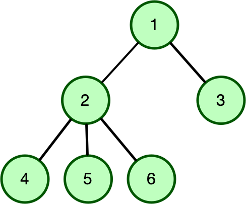

# Homework \#1

**See gradescope for due date**

> **Note:**
> Please insert your name and UChicago email in the file "name_email.txt".
> This will help TA's and graders (and me) identify
> your submissions, particularly if your github username is different from the
> name that you used to register for class.

This homework is intended to serve as an introduction to the Go
programming language. This assignment is not meant to cover the entire
language. It solely serves as a way for you to get familiar with the Go
syntax and the structure of Go programs.

> **Note:**
> If you were in enrolled in the compilers class by Lamont Samuels then some of the
> problems from homework 1 are similar/same. You may use the same solution
> for your prior solution for this homework assignment only. If you have
> any concerns than reach out to me on Ed privately.

Please make sure to use the “Go by Example” and standard library
websites:

  - <https://gobyexample.com>
  - <https://golang.org/pkg/>

Additionally, refer back to the module 1 slides that indicate the
specific “Go by Example” pages you should read over. Please make sure
you understand those pages before beginning your homework assignment.

## Utils Package

Place any code that will be shared between the problems within this
homework assignment inside the `utils/utils.go` file. It is not required
to have anything inside of this file. Only place code inside this file
if there are functions that can be used in different problems. There is
a Contains function already defined in this file. Please keep this
function there.

## Running Tests

Each problem in this assignment (and future assignments) will include a
series of test cases. You can run all the tests cases by using `go
test`. For example, if you wanted to run all test cases for `problem1`
then go inside the `problem1` directory (i.e., `cd problem1`) and
execute the following command:

    go test -v

The `-v` runs the tests in `verbose` mode so you can more clearly see
the tests you pass and fail.

Many of the tests are ran in a single function that use a table to
indicate the inputs and expected outputs for a single test. For example,
the table for `problem1` looks like this:

    func TestExpand(t *testing.T) {
    
      var tests = []struct {
          input    string
          expected []int
      }{
          {"", []int{}},
          {"2", []int{2}},
          {"1,2,3,3,3,3-4", []int{1, 2, 3, 4}},
          {"1-2,1-2,1-2,3,3,3,3-4,1-2,1-2,3-4", []int{1, 2, 3, 4}},
          {"Invalid,3,4", []int{3, 4}},
          {"4 43, 4,", []int{4}},
          {"1-4,7,3-5,10,12-14", []int{1, 2, 3, 4, 5, 7, 10, 12, 13, 14}},
          {"1-4, 4  , 5-6  , 5", []int{1, 2, 3, 4, 5, 6}},
          {"            1-4", []int{1, 2, 3, 4}},
          {"1-", []int{}},
          {"1-,45,-4,1-2", []int{45, 1, 2}},
          {"-4,----,4-,25  7, 55     ", []int{55}},
          {"17,1--4,", []int{17}},
          {"19-3,1-,Bob,1-2-3,4,", []int{4}},
          {"3-3,1-,Bob,1-2-3,4-4-4,          ", []int{}},
          {"3    -      4,1-,Bob,1-2-3,4-4-4,          ", []int{}},
      }

What if you wanted to run the fourth test-case (i.e.,
`"1-2,1-2,1-2,3,3,3,3-4,1-2,1-2,3-4"`)? This test is at index 3 in the
table (using zero-indexing) and can be executed as follows:

    go test -v -run ^TestExpand/T=3$

You need to use the anchors `^` before and `$` at the very end of the
specifying the test you wish to run. Between the anchors, specify the
test function (`TestExpand`) followed by a `/` and then `T=NUM`, where
`NUM` is the index of the test case you want to run. You can use this
same format for all table tests. Please note that anything after the
`run` flag is just a regular expression and you specify various ways to
run different tests using regular expression syntax.

## Problem 1

Inside the `problem1` directory, open the file called `expand.go` and
implement the following function:

``` go
func Expand(intList string) []int
```

This function takes in a comma-separated list of integers and/or integer
ranges, provided by the `intList` argument and returns a slice of all
the integers with the ranges expanded into individual integers. Order
does not matter. All the integers included are only positive. **You need
to exclude duplicates**. The components between the commas could contain
values that is not a single integer or a range, where a valid range has
the format `MIN-MAX`. `MIN` and `MAX` are single positive integers.
`MAX` must be greater than `MIN`. There cannot be whitespace between the
`-`. If the function encounters an invalid component then it should skip
it and continue processing the other components of the list. It is valid
for there to be one or more whitespace characters before and after a
component.

Sample Example 1:

    Expand("1,2,3,3,3,3-4") --> []int{1, 2, 3, 4} 

Sample Example 2:

    Expand(" 1-4, 4  , 5-6  , 5") --> []int{1, 2, 3, 4, 5, 6} 

Sample Example 3:

    Expand("4 43, 4,") --> []int{4} 

Sample Example 4:

    Expand("1-,45,-4,1-2") --> []int{45, 1, 2} 

The tests for this file is `expand_test.go`. Please see the above
section for running tests.

## Problem 2

Inside the `problem2` directory, open the file called `log.go` and
implement the following function:

``` go
func ProcessLog(log []string, maxDuration int) int
```

Imagine you are front-desk associate at a luxury condominium, where each
day visitors have to sign a log indicating when they came in and out of
the building. Futhermore the condominium only allows visitors to stay
for a certain amount of time. For this problem, you will find the number
of visitors who obeyed the rule and stayed less than or equal to the
allowed maximum duration time by looking at the log.

`ProcessLog` takes in a slice of strings that represent entries into the
log. Each log entry (i.e., a single string in the slice) is of the form
`"visitor_num timestamp action"`. The values is separated by a single
comma. Both `visitor_num` and `timestamp` contain digits only, are at
most 9 digits long and start with a non-zero digit. The `timestamp`
represents the time in seconds since the start of the day. The `action`
will be either "IN" or "OUT". The function only looks at entries for
visitors who signed in and out. The log entries are no specific order.
There could be one or more whitespace characters before or after a
comma. The second argument is the maximum duration time allowed for each
visitor. This function returns the total number of visitors who stayed
less than or equal to the maximum duration time specified.

Sample Example 1:

    ProcessLog(["50, 26, OUT"
                "100, 15, OUT"
                "99, 1, IN"
                "50, 20, IN"
                "99, 2, OUT"
                "100, 10, IN"], 5) --> 2

Sample Example 2:

    ProcessLog(["60, 12, IN"
                "80, 20, OUT"
                "60, 20, OUT"
                "10, 20, IN"], 100) --> 1

**Assumptions**: The sign-in timestamp will always be less than the sign
out timestamp for each user. Each visitor only visits the condominium
only once.

The tests for this problem is inside the `log_test.go` file. Please see
the above section for running tests.

## Problem 3

Inside the `problem3` directory, open the file called `nary.go` and
implement the following function:

``` go
SearchTree(edges []string, nAry int) int
```

For this course, you'll need to be comfortable working with different
tree representations. As a reminder, a tree contains a root value and
subtrees of parent-child pairs, for example:

    1 2
    1 3
    2 4
    2 5
    2 6



`Node 1` is the parent of `Node 2` and `Node 3`. The parent of `Node 4`,
`Node 5`, and `Node 6` is `Node 2`.

The are many different types of trees (binary trees, binary search
trees, AVL trees, etc.). For this problem, we will look at trees that
have a specific arity, that is each node can only have a maximum number
of children. For example, both a binary tree and binary search tree have
an arity of 2 because each node can only have two children. For this
problem, you will calculate the number of nodes (including the root
node) that have children that are greater than the tree arity. For
example, if we specified the above tree has an arity of 1 then there are
two nodes that children greater than 1. This is `Node 2` and the root
node `Node 1`. If we specified arity to be 3 then no node has children
that are greater than 3.

`SearchTree` takes in two arguments. The first is a slice of strings,
where each string corresponds to a parent-child pair. Each of these
pairs are two numeric numbers, each separated from the next by a single
space, corresponding to edge from the first node to the second node.
There is no specific order to the parent-child pair, except that index 0
always represents the root of the tree. There could be one or more
whitespace characters before or after a space. The second argument
represents the arity of for the tree. This function must return the
number of nodes (including the root) that are greater than the arity of
the tree. For this problem you will notice the following data structures

``` go
// You cannot modify the name of this struct
type Node struct {
      // You may add as many fields to this struct as you wish 
}
//You cannot modify this data structure at all (including its types). However 
// You are not required to use all of its fields. 
type Tree struct {
    root  *Node
    nAry  int
    nodes map[string]*Node
}
```

You **must** use both of these data structures as part of your solution
to this problem. You are not allowed to modify the `Tree` data
structure. However, you are not required to use all of the fields within
the struct. We will let you choose which fields to use. You are allowed
to add as many fields as you like to the `Node` data structure and use
them as you wish to solve the problem.

The tests for this problem is inside the `nary_test.go` file. Please see
the above section for running tests.

## Problem 4

Inside the `set/intset.go` file, review the struct called `IntSet` that
represents a set of integers:

``` go
type IntSet struct {
  intSeq []int // Uses a slice to hold the set of integers. You can change this field to have a different type. 
}
```

You are required to have the following methods associated with the type:

1.  `func NewIntSet() *IntSet`: This function is already defined for
    you. It allows you to create and initialize an empty `IntSet`
    pointer. Take a close look at `&` that is needed to return a
    pointer. You will need to use that in the following methods. We will
    talk more about this in Week 2.
2.  `func (recv *IntSet) Add(num int)`: This method inserts an integer
    into the set. Make sure the set does not contain duplicates\!
3.  `func (recv *IntSet) Union(other *IntSet) *IntSet`: This method
    performs a set union operation on the `recv` integer set and `other`
    integer set and returns the set produced after performing the
    operation.
4.  `func (recv *IntSet) Intersect(other *IntSet) *IntSet`: This method
    performs a set intersect operation on the `recv` integer set and
    `other` integer set and returns the set produced after performing
    the operation.
5.  `func (recv *IntSet) Diff(other *IntSet) *IntSet`: This method
    performs a set relative complement operation on the `recv` integer
    set and `other` (i.e., difference `recv - other`) integer set and
    returns the set produced after performing the operation.

You may add additional methods as needed. Remember, a set cannot contain
duplicates.

Now, lets write the actual program. Inside the `problem4/main.go`, write
a program that takes in a set argument and file on the command line. The
file contains two lines where each line has a series of integers
separated by a space. Each line represents an integer set. Your program
is required read in those lines and create two `IntSets`.

Assume their exist a file called `sets1.txt` that contains the
following:

    2 3 
    1 2

Assume their exist a file called `sets2.txt` that contains the
following:

    1 2 
    1 2

When running the program, the user must specify one of the following set
arguments:

  - union : Perform the union of the two sets in the file and print out
    the resulting set.

  - intersect : Perform the intersection of the two sets in the file and
    print out the resulting set.

  - diff : Perform the difference of the two sets in the file and print
    out the resulting set. If the first line of sets1.txt is A and the
    second line of sets2.txt is B then this flag should compute A - B.

  - The output must be printed using set notation syntax (i.e., `{5,3,
    ...}`). **Only** for printing, you must print the items in the set
    in sorted order mainly to make the test cases work. Do not print anything
    else out to the command line.

  - if no file or option is given : Print the following usage statement:
    
        Usage: problem4  <union | intersect | diff> file
    
    Do not print anything else out to the command line.

Sample Runs ($: is just mimicking the command line) :

    $: go run hw1/problem4 union problem4/sets1.txt
    {1, 2, 3}
    $: go run hw1/problem4 intersect problem4/sets1.txt
    {2}
    $: go run hw1/problem4 diff problem4/sets2.txt
    {}
    $: go run hw1/problem4 diff
    Usage: problem4  <union | intersect | diff> file
    $: go run hw1/problem4 problem4/sets2.txt
    Usage: problem4  <union | intersect | diff> file
    $: go run hw1/problem4
    Usage: problem4  <union | intersect | diff> file

**Assumptions**: You can assume that the file given will always be a
valid file. You are guaranteed that the set that is given in the test
files are actual sets (i.e., you are guaranteed there are no duplicate
numbers in a line in the input). You are also guaranteed they will only
be integers.

  - Helpful References:
    
      - <https://gobyexample.com/structs>
      - <https://gobyexample.com/command-line-arguments>

The tests for this problem is inside the `problem4_test.go` file. Please
see the above section for running tests.

## Grading

Programming assignments will be graded according to a general rubric.
Specifically, we will assign points for completeness, correctness,
design, and style. (For more details on the categories, see our
[Assignment Rubric page](../index.html).)

The exact weights for each category will vary from one assignment to
another. For this assignment, the weights will be:

  - **Completeness:** 80%
  - **Correctness:** 10%
  - **Design & Style** 10%

### Obtaining your test score

The completeness part of your score will be determined using automated
tests. To get your score for the automated tests, simply run the
following from the **Terminal**. (Remember to leave out the `$` prompt
when you type the command.)

    $ cd grader
    $ go run hw1/grader hw1

This should print total score after running all test cases inside the
individual problems. This printout will not show the tests you failed.
You must run the problem's individual test file to see the failures.

## Design, Style and Cleaning up

Before you submit your final solution, you should, remove

  - any `Printf` statements that you added for debugging purposes and
  - all in-line comments of the form: "YOUR CODE HERE" and "TODO ..."
  - Please make sure to use `CamelCase` conventions for identifiers
    (e.g., variable names, function names, struct names, etc.).
  - Think about your function decomposition. No code duplication. This
    homework assignment is relatively small so this shouldn't be a major
    problem but could be in certain problems.

Go does not have a strict style guide. However, use your best judgment
from prior programming experience about style. Did you use good variable
names? Do you have any lines that are too long, etc.

As you clean up, you should periodically save your file and run your
code through the tests to make sure that you have not broken it in the
process.

## Submission

Before submitting, make sure you've added, committed, and pushed all
your code to GitHub. You must submit your final work through Gradescope
(linked from our Canvas site) in the "Homework \#1" assignment page via
two ways,

1.  **Uploading from Github directly (recommended way)**: You can link
    your Github account to your Gradescope account and upload the
    correct repository based on the homework assignment. When you submit
    your homework, a pop window will appear. Click on "Github" and then
    "Connect to Github" to connect your Github account to Gradescope.
    Once you connect (you will only need to do this once), then you can
    select the repository you wish to upload and the branch (which
    should always be "main" or "master") for this course.
2.  **Uploading via a Zip file**: You can also upload a zip file of the
    homework directory. Please make sure you upload the entire directory
    and keep the initial structure the **same** as the starter code;
    otherwise, you run the risk of not passing the automated tests.

> **Note:**
> For either option, you must upload the entire directory structure;
> otherwise, your automated test grade will not run correctly and you will
> be **penalized** if we have to manually run the tests. Going with the
> first option will do this automatically for you. You can always add
> additional directories and files (and even files/directories inside the
> stater directories) but the default directory/file structure must not
> change.

Depending on the assignment, once you submit your work, an "autograder"
will run. This autograder should produce the same test results as when
you run the code yourself; if it doesn't, please let us know so we can
look into it. A few other notes:

  - You are allowed to make as many submissions as you want before the
    deadline.
  - Your completeness score is determined solely based on the automated
    tests, but we may adjust your score if you attempt to pass tests by
    rote (e.g., by writing code that hard-codes the expected output for
    each possible test input).
  - Gradescope will report the test score it obtains when running your
    code. If there is a discrepancy between the score you get when
    running our grader script, and the score reported by Gradescope,
    please let us know so we can take a look at it.
